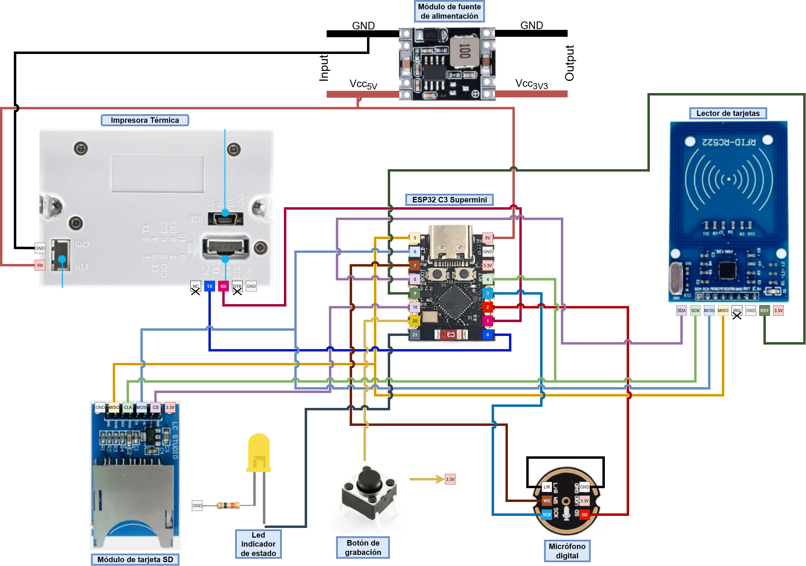

# RemiBot

En este repositorio se incluye el código del proyecto Remi.
Para poner en marcha seguir los siguientes pasos:

## Modificaciones en el código
Antes de nada es importante configurar los parámetros etiquetados como *MODIFICAR* en el código, siendo los siguientes:
- Crear un bot de telegram
- Configuración de la red wifi, nombre y clave del bot creado
- Configuración de la numeración de los pines del código si se modifican de acuerdo a lo especificado en el README
- Configuración de los usuarios aceptados por el bot (UID de tarjeta de respuesta asociada, ID del usuario de telegram, Nombre del usuario) 
- El ID de usuario de telegram se imprime por serial en la terminal si esta conectada independientemente de que sea o no un usuario de la lista, esto permite conocer el id asociiado.

## Conexiones HW:
Asegurar las conexiónes HW de acuerdo a la siguiente imagen y los pines especificados en el código

## Ensamblaje
Imprimir la carcasa disponible en el repositorio y seguir los siguientes pasos de ensamblaje:
